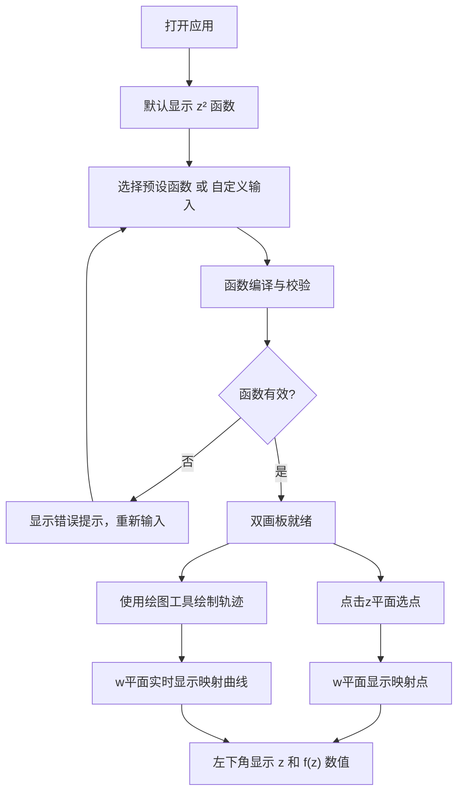

## 1. 产品概述
复变函数计算器是一个面向数学学习者和研究者的交互式可视化工具，通过双画板联动展示复变函数中自变量 z 与因变量 f(z) 的映射关系，支持自定义函数与多种轨迹绘制。

- 核心价值：将抽象的复变函数映射关系具象化，让用户直观理解复平面变换
- 目标用户：数学专业学生、教师、科研人员、数学爱好者

## 2. 核心功能

### 2.1 功能模块
1. **主计算页面**：双复数画板（z 平面 / w 平面）、函数编辑器、绘图工具栏、数值显示面板

### 2.2 页面详情
| 页面名称 | 模块名称 | 功能描述 |
|-----------|-------------|---------------------|
| 主计算页面 | 自变量画板(z平面) | 复平面坐标系，支持点击选点、绘制轨迹，显示网格和坐标轴 |
| 主计算页面 | 因变量画板(w平面) | 复平面坐标系，实时显示 f(z) 映射结果，与z平面联动 |
| 主计算页面 | 点选联动 | 点击z平面任意点，w平面同步显示对应映射点，高亮显示 |
| 主计算页面 | 数值显示面板 | 页面左下角实时显示当前选中的 z 值和 f(z) 复数值 |
| 主计算页面 | 自由画笔工具 | 鼠标自由绘制任意曲线，实时映射到w平面 |
| 主计算页面 | 直线工具 | 两点确定一条直线段，z平面画直线，w平面显示映射曲线 |
| 主计算页面 | 圆弧工具 | 三点或圆心+半径+角度画圆弧，映射到w平面 |
| 主计算页面 | 函数编辑器 | 支持自定义 f(z) 表达式，实时编译解析 |
| 主计算页面 | 函数库预设 | 提供常见复变函数预设（z²、e^z、sin(z)、1/z、log(z)等） |
| 主计算页面 | 清除/撤销 | 清除画板内容、撤销上一步操作 |
| 主计算页面 | 缩放平移 | 两个画板支持独立缩放和平移 |

## 3. 核心流程

用户打开页面 → 选择预设函数或输入自定义 f(z) → 点击z平面选点观察映射 → 使用绘图工具在z平面绘制轨迹 → w平面实时显示映射结果 → 查看左下角复数值信息

## 4. 用户界面设计

### 4.1 设计风格
- **整体风格**：深色科技风格，数学软件专业质感
- **主色调**：深蓝底色 (#0a0e1a)，辅色青蓝 (#00d4ff)，强调色紫色 (#a855f7)，轨迹色橙红渐变
- **画板样式**：深色网格背景，坐标轴线高亮，刻度精细
- **按钮风格**：圆角方形，轻微投影，悬停发光效果
- **字体**：等宽字体显示复数值（JetBrains Mono），标题使用现代无衬线字体
- **图标风格**：线性简洁图标，数学符号风格

### 4.2 页面设计概述
| 页面名称 | 模块名称 | UI 元素 |
|-----------|-------------|-------------|
| 主计算页面 | 整体布局 | 左侧函数编辑与工具栏，右侧上下排布双画板，底部数值栏 |
| 主计算页面 | 双画板区域 | z平面在上、w平面在下，大小相等，标题标签区分 |
| 主计算页面 | 函数编辑器 | 代码编辑风格输入框，语法高亮，编译按钮，预设下拉菜单 |
| 主计算页面 | 绘图工具栏 | 工具按钮组（选择/自由线/直线/圆弧/清除/撤销），当前工具高亮 |
| 主计算页面 | 数值面板 | 左下角半透明卡片，z 和 w 值分两行，实部虚部分色显示 |
| 主计算页面 | 画板内部 | 复平面网格、实轴(红)、虚轴(绿)、原点标记、刻度数字 |

### 4.3 响应式设计
- 桌面优先设计：双画板并排或上下布局，确保足够绘图空间
- 适配中等屏幕：画板自适应宽度，工具栏可折叠
- 触控设备：支持触摸绘图操作，按钮尺寸适配

### 4.4 动效设计
- 页面加载：元素渐入动画，画板网格淡入
- 选点联动：z→w 之间瞬时高亮连接线闪现反馈
- 绘图轨迹：实时绘制时带轻微拖尾效果
- 按钮交互：悬停时颜色渐变 + 外发光，点击时缩放反馈
- 错误提示：函数编译失败时输入框边框红色脉冲
