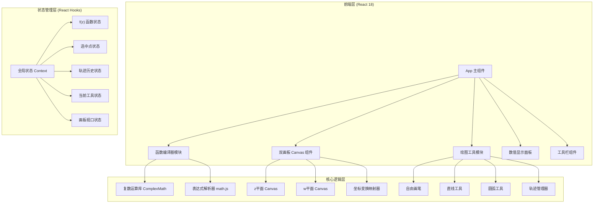

## 1. 架构设计



## 2. 技术描述
- **前端框架**：React@18 + Vite@5
- **样式方案**：TailwindCSS@3
- **数学解析**：mathjs（表达式解析 + 复数运算）
- **绘制技术**：原生 HTML5 Canvas 2D（双画板独立渲染）
- **状态管理**：React Context + useReducer
- **构建工具**：Vite 初始化 React 项目

## 3. 路由定义
| 路由 | 用途 |
|-------|---------|
| / | 主计算器页面（单页应用，唯一页面） |

## 4. 核心模块设计

### 4.1 复数运算模块 (ComplexMath)
```typescript
// 复数类型
interface Complex {
  re: number; // 实部
  im: number; // 虚部
}

// 核心运算
add(a: Complex, b: Complex): Complex
sub(a: Complex, b: Complex): Complex
mul(a: Complex, b: Complex): Complex
div(a: Complex, b: Complex): Complex
pow(base: Complex, exp: Complex | number): Complex
exp(z: Complex): Complex
log(z: Complex): Complex
sin(z: Complex): Complex
cos(z: Complex): Complex
tan(z: Complex): Complex
abs(z: Complex): number
arg(z: Complex): number
sqrt(z: Complex): Complex
conj(z: Complex): Complex
```

### 4.2 函数编译器模块
```typescript
// 将用户输入字符串编译为可执行函数
compileFunction(expr: string): (z: Complex) => Complex
// 预设函数库
PRESETS: { name: string; expr: string; description: string }[]
// = [
//   { name: "z²", expr: "z^2", description: "平方函数" },
//   { name: "e^z", expr: "exp(z)", description: "指数函数" },
//   { name: "sin(z)", expr: "sin(z)", description: "复正弦" },
//   { name: "cos(z)", expr: "cos(z)", description: "复余弦" },
//   { name: "1/z", expr: "1/z", description: "倒数/反演变换" },
//   { name: "log(z)", expr: "log(z)", description: "主值对数" },
//   { name: "z^3", expr: "z^3", description: "立方函数" },
//   { name: "sqrt(z)", expr: "sqrt(z)", description: "平方根主值" },
//   { name: "z+1/z", expr: "z + 1/z", description: "Joukowski映射" },
// ]
```

### 4.3 画板组件 (ComplexPlane)
```typescript
interface PlaneState {
  center: { x: number; y: number }; // 视口中心（复数坐标）
  scale: number;                     // 像素/单位复数
}
// 双向坐标转换
screenToComplex(px: number, py: number): Complex
complexToScreen(z: Complex): { x: number; y: number }
// 绘制网格和坐标轴
drawGrid()
drawAxes()
// 绘制轨迹
drawPath(points: Complex[], color: string, width: number)
// 绘制点
drawPoint(z: Complex, color: string, size: number, label?: string)
```

### 4.4 绘图工具模块
```typescript
type Tool = 'select' | 'free' | 'line' | 'arc' | 'erase' | 'undo';
// 自由画笔：mousedown→mousemove采样点→mouseup提交轨迹
// 直线工具：第1点起点，第2点终点，中间自动插值
// 圆弧工具：点击圆心，拖动确定半径，释放确定角度范围
```

### 4.5 状态管理接口
```typescript
interface AppState {
  functionExpr: string;
  compiledFn: ((z: Complex) => Complex) | null;
  compileError: string | null;
  selectedPoint: Complex | null;
  mappedPoint: Complex | null;
  paths: { zPoints: Complex[]; wPoints: Complex[]; color: string; id: string }[];
  activeTool: Tool;
  zPlane: PlaneState;
  wPlane: PlaneState;
}
```

## 5. 文件结构
```
复变函数计算器/
├── index.html
├── package.json
├── vite.config.js
├── tailwind.config.js
├── postcss.config.js
└── src/
    ├── main.jsx
    ├── App.jsx
    ├── index.css
    ├── core/
    │   ├── complex.js        # 复数运算库
    │   ├── compiler.js       # 函数编译器
    │   └── presets.js        # 预设函数
    ├── components/
    │   ├── ComplexPlane.jsx  # 复平面画板
    │   ├── FunctionEditor.jsx# 函数编辑器
    │   ├── Toolbar.jsx       # 绘图工具栏
    │   ├── ValueDisplay.jsx  # 数值显示面板
    │   └── PresetMenu.jsx    # 预设函数菜单
    ├── hooks/
    │   └── useAppState.js    # 全局状态 Hook
    └── context/
        └── AppContext.jsx    # Context Provider
```
